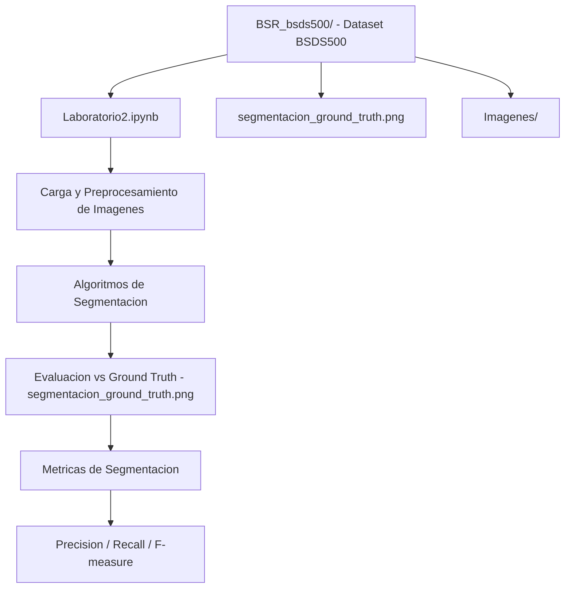

# 📁 Proyecto Evaluacion De Segmentacion Percepcion Computacional

### Desarrollo propio — Alejandro De Mendoza

*Proyecto desarrollado en el marco de la Ingeniería Informática, Especialización en IA e Ingeniería de Software y Maestría en Arquitectura de Software — Politécnico Grancolombiano*

---

## ¿Qué es esto?

Proyecto de desarrollo propio realizado por **Alejandro De Mendoza** como parte de su formación académica y profesional en Ingeniería Informática, especialización en Inteligencia Artificial e Ingeniería de Software, y Maestría en Arquitectura de Software.

---

## Arquitectura

## Autor

**Alejandro De Mendoza**  
Ingeniero Informático · Especialista en IA · Especialista en Ingeniería de Software · Máster en Arquitectura de Software

